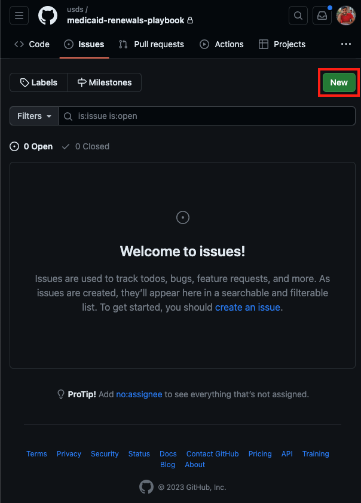

# USDS Medicaid Renewals Playbook - Contribution

Thank you for contributing the this playbook! It's our goal to keep this playbook **open, collaborative, and evolving**. The strategies documented here didn't start with us; we just happened to be the ones who wrote them down. They won't end with us either! We welcome all contributions from everyone involved in any stage of this process.

## Opening an Issue

The quickest way to give feedback is to [open an issue](https://github.com/usds/medicaid-renewals-playbook/issues). Issues can be used for anything for anything from broken links and grammatical errors to suggested content and new strategies.

To create an issue, under the [Issues](https://github.com/usds/medicaid-renewals-playbook/issues) page, click "New" or "New Issue".

Give your issue a Title, and please fill out the following:
  - **What's your name?**
  - **What organization are you from?**
  - **What feedback would you like to leave?**

Then submit your issue! We'll follow up.

## Contributing Content

If you'd like to contribute new pages, or edit existing ones yourself, please [fork the repository](https://docs.github.com/en/get-started/quickstart/fork-a-repo) and create a [pull request](https://docs.github.com/en/get-started/quickstart/contributing-to-projects#making-a-pull-request).

## Getting in Touch

If you have any issues with contribution, please feel free to reach out to phe-renewals@usds.gov, and we'll get back to you!
