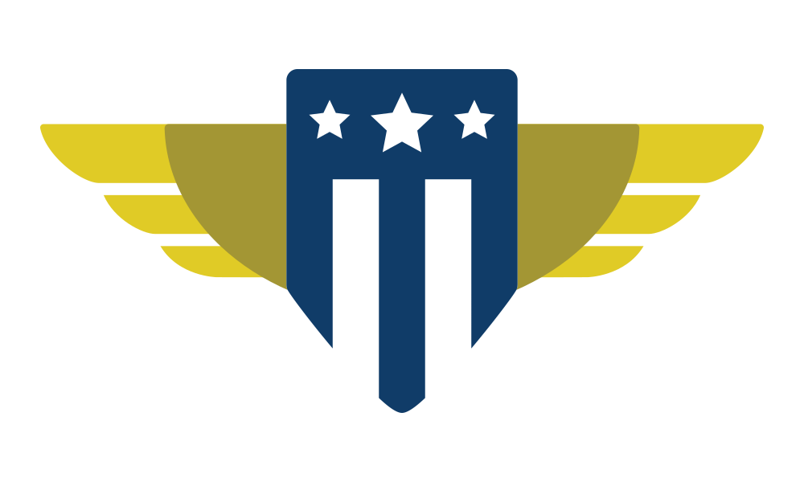

  
  </img>

  # U.S. Digital Service - Medicaid Renewals Playbook

## Background

This playbook was created by the U.S. Digital Service as a rapid-response guide for civic technologists providing direct technical assistance to states during Public Health Emergency (PHE) Unwinding. The content in this playbook focuses on strategies to decrease the burden of Medicaid renewals on members of the public and state staff.

This guidebook should **NOT** be considered as authoritative, legal, or regulatory content. It is advisory only, and should be adapted for each particular environment and scenario.

_[How to add to this guide](./CONTRIBUTING.md)_

---

Plays:
- [1 - Establish Trust and Urgency](#play-1)
- [2 - Identify Problems](#play-2)
- [3 - Generate Solutions](#play-3)
- [4 - Prioritize and Implement](#play-4)

Common issues:
- [Common Ex Parte Issues](./ex-parte-renewals)
- [Common Manual Renewal Issues](./manual-renewals)

---

## Plays

### 1 // Establish Trust and Urgency

It is crucial to establish a relationship of trust with state partners from the beginning of an engagement. Every stage of the process is predicated on an exchange of details and data. This exchange may not be comfortable with state partners, as it may (and hopefully will) expose issues in their implementation and processes. Establishing trust is the single most important tool for counteracting this discomfort.

In addition, it's important that all members of the team (including any and all vendors) understand the urgency and criticality of the project. Leadership should be engaged regularly from the beginning, and the work should be made a top priority. Common goals should be established such that everyone understands what “success” looks like.

* **Keep states' needs top of mind.** States are under an immense amount of pressure right now. Be mindful of the amount of work state staff have on their plates, celebrate the great work they're already doing, and focus the scope of work around the most urgent state needs.
* **Orient the team around OUTCOMES, not compliance.** Quickly establish norms around what will (and won't) be reported, and who needs to be consulted beforehand.
* **Get buy-in from senior leadership, including the [State Medicaid Director](https://medicaiddirectors.org/wp-content/uploads/2023/06/Public_DirectorsList_June2023-1.pdf) and Deputy Director.** Establish this work as the top priority for the team.
* **Convene a cross functional group** of subject matter experts and decision makers, including Policy, Communications, Human-Centered Design and Technical experts (including vendor teams)
* **Determine one or two North Star(s).** What goals are we specifically working towards? These should be measurable (“increase automatic renewals to XX%”) but don't have to be numeric (“stand up an online renewal form”).
* **Adopt terminology from the state.** For example, if they call a renewal a “review”, this should be the term used throughout the work. 
* **Go where the work is.** Travel to where your state partners and their Medicaid members are.

#### Workshops and Meetings

- [Hypothesis Generation Workshop](./workshops-and-meetings/hypothesis-generation-workshop.md): This workshop provides an opportunity for the team and the state staff to come up with hypotheses on where to focus time.
- [Kickoff](./workshops-and-meetings/kickoff.md): This meeting is the "kickoff" where state staff and the team align on goals and the work moving forward.

#### Resources

- [Example Project Charter](./resources/example-project-charter.docx): This is an example charter used to establish the goals, dates, and activities of the engagement between the civic tech organization and the state human services agency.
- [Medicaid 101](./resources/medicaid-101.pdf): This is a _very brief and informal_ overview of the Medicaid program. This presentation **should not** be taken as legal authority or advice, but used as a quick introduction to the program.
- [Example On-Site Schedule](./schedule.md): This is an example schedule for the week of the on-site engagement. Work typically happens in the weeks prior and following, but the on-site week is typically the most impactful.

[Back To Top](#top)

---

### 2 // Identify Problems

Working with the state and external partners, determine where the largest sources of failures are occurring while people are renewing. Where are people being moved from automatic renewal to manual renewal? Where are people struggling or failing when completing a renewal? What methods are most commonly utilized, and what are the biggest problems with those methods?

When determining the problems, it's important to keep the focus on the “end-to-end” renewal process. An ex parte attempt is only the first step in a person's renewal. For the millions of people manually renewing, there are vast opportunities to improve the experience and increase renewal rates.

* **Pull the numbers.** Pull end-to-end funnel data, including where drop-offs occur at each step in the renewal process. Pull ex parte failure reasons, and organize by the number of people impacted. Pull web traffic numbers to understand how people are accessing online renewal materials.
* **Be a renewer.** Put your renewer hat on and do some Googling to figure out how to renew Medicaid in your state. Do this on mobile, record screenshots as you go, and note pain points throughout the process. Call customer support when you get stuck, take notes on the IVR and overall experience.
* **Learn from experts.** Meet with Navigators and eligibility workers to identify top challenges across the renewal process that members of their community experience. Meet in smaller groups with state SMEs and decision makers to better understand the challenges they've been dealing with.
* **Map the experience.** Map a high-level user journey of the renewal end-to-end experience, noting common pain points and workarounds.

#### Workshops and Meetings

* [Navigator Workshop](./workshops-and-meetings/navigator-workshop.md): Typically, at the beginning of the week, we hold a convening of Navigators focused on generating potential solutions.
* [Ex Parte Workshop #1](./workshops-and-meetings/ex-parte-workshop.md): The first ex parte workshop, typically held in the week of the on-site, is focused on identifying opportunities for improvement in the ex parte renewal flow.
* [Manual Renewal Workshop #1](./workshops-and-meetings/manual-renewal-workshop.md): The first manual renewal workshop, typically held in the week of the on-site, is focused on bringing the experiences and solutions from research with Navigators to the state so that solutioning can begin.

#### Resources

* [Example Data Request Worksheet](./resources/data-request-worksheet.xlsx): This is a worksheet that can be used by the state to begin measuring their renewal flows. Most states will not be able to fill out the entirety of it; that's okay! This should be adapted for the particular state.
* [Example State Renewals Funnel](https://app.mural.co/t/usdigitalservice0135/m/usdigitalservice0135/1697032143290/0ae29a54efb9ed41a03dbba35e11e7eba60cfa1e?sender=u46dc9256beb1576a38081536): This is a method of visualizing the "funnel" of Medicaid renewals, and determining which points are the most important to focus on.
* [Navigator Research Guide](./navigator-research-guide.docx): Working with Navigators is crucial for the success of renewals work. This guide provides a set of resources for explaining, justifying, preparing, and performing work with Navigators. It includes background information on Navigator organizations, example research plans, and email templates for correspondence.
* Example Renewer journey map

[Back To Top](#top)

---

### 3 // Generate Solutions

Once problems have been identified, work with the broader cross-functional team to start generating solutions. Often times there will be more problems available to solve than possible to talk through in the given time. Start with high-impact and/or low-effort problems, and present them in turn for consideration. Solutions should be high-level, but estimable. Whenever possible, rely on data or similar solutions in other states as evidence that the solution will, in fact, solve the problem.

Whenever possible, scope should be reduced towards the minimum viable solution. When implementation timelines are given, push back on them if they seem unreasonable. Ask which for clarity on the stages of implementation, and which are projected to take the most amount of time. Can they be reduced? For example, if a change is completely back-end, eliminate any front-end testing. If a change will only affect mobile users, eliminate Desktop testing. If a website is not functional on mobile, change only the pieces to make it functional (as opposed to friendly). Keep asking “why” until the timeline is definitively as small as possible.

* **Use the lived experiences of experts.** If the team was able to meet with Navigators and case workers before a solutioning session with the state, bring their ideas and solutions to the table. Treat these as expert opinions, and champion them whenever possible.
* **Work collaboratively and let states be the heroes.** When solutions are being discussed, the decision makers and implementors should be in the room, driving the process. Give equal weight to everyone's voice, and specifically call out those with on-the-ground knowledge. Pass around artifacts (like a copy of the renewal packet, if available) and let them make changes themselves.
* **Reference Medicaid rules and regulations.** Any solution MUST be palatable to state policy experts, or it cannot be implemented. Whenever possible, use rules and regulations to create a safe policy space for solutioning. If policy concerns are brought up broadly, read the policy and use it to make a risk calculation. A policy may prohibit something, but in practice that situation may never occur; use lived experiences of Navigators and case workers to make that clear.
* **Keep asking “why”.** If a timeline doesn't make sense, or seems unrealistic, ask for specifics. If the explanation doesn't make sense, ask for more. We don't need to be the experts on the state systems or processes, but we do need to recognize when a solution isn't as efficient (or impactful) as it can be. “Policy” is often cited as a reason something can't be done; ask for the regulation.
* **Find the minimum viable solution.** Working with the state staff, eliminate parts of the implementation process that are unnecessary. Focus specifically on stages that may are prone to inflation: testing, for example, or administrative processes. Can these stages be reduced? Don't be satisfied until any solution is the smallest viable solution possible.

#### Workshops and Meetings

* [Ex Parte Workshop #2](./workshops-and-meetings/ex-parte-workshop.md): The second ex parte workshop is focused around implementation details and aligning on potential solutions.
* [Manual Renewal Workshop #2](./workshops-and-meetings/manual-renewal-workshop.md): The second manual renewal workshop is focused around determining implementation plans and assigning owners to action items.

[Back To Top](#top)

---

### 4 // Prioritize and Implement

There will always be more problems to solve than there are resources available to solve them. Prioritizing with stakeholders allows the implementation teams to focus correctly on areas with the highest impact and quickest timelines.

The two most important metrics to consider when prioritizing are impact and speed. Impact is typically measured in number of successful renewals per month, while speed is measured in time to implementation. Importantly, these numbers are almost always estimates, and can be very rough; for example, improving the design of a renewal notice may increase the number of successful renewals based on the number of people receiving the notice, but it is difficult to estimate.

Once a set of solutions is prioritized, the state and vendor work together to schedule implementation and begin work. If helpful, play a part in that process as well, taking on roles ranging from advisor to individual contributor.

* **Let the state drive implementation.** States should own and manage the implementation work, and use the civic technology team as much (or as little) as they see fit. Ensure stakeholders are aware of the team's availability, strengths, and connections. If they don't need any extra help, let them do the work!
* **Meet regularly if needed.** If helpful, meet with stakeholders on a regular basis after the engagement. Gauge how well the work is progressing, and where potential roadblocks could occur.
* **Ask for metrics.** Measuring the impact of the engagement is crucial to ensuring the state and civic technology team's time was well spent. If possible, utilize rigorous methods like A/B testing, pilots, and randomized trials to gather quality data of the effectivity of solutions.

#### Workshops and Meetings

* [Closing Meeting](./workshops-and-meetings/closing.md): This meeting is typically held at the end of the on-site week. It is an opportunity to present recommendations to the state senior leadership, and re-affirm the agreed upon actions.
* [Prioritization Session](./workshops-and-meetings/prioritization-session.md): This session can help the state determine which recommendations require immediate action VS long-term.

#### Resources

* [Example Recommendations Document](./resources/example-recommendations-document.docx): At the end of the on-site week, all recommendations agreed upon by _both the state and the civic technology team_ are documented in this recommendations report, which is then delivered to the state Medicaid leadership.

[Back To Top](#top)
