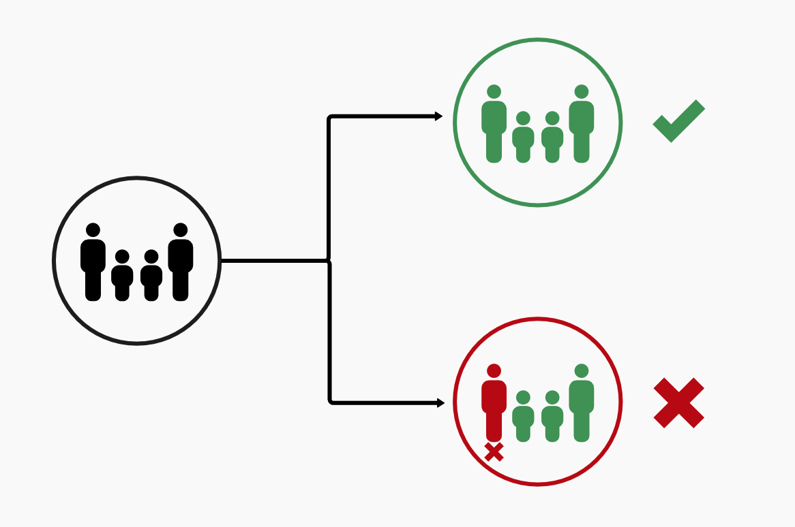
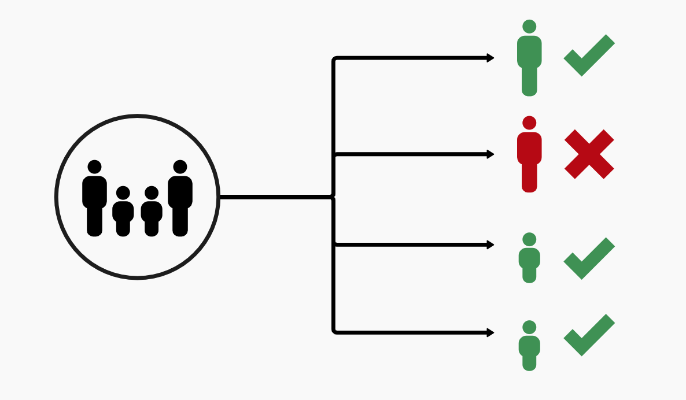

# Individual/household determinations

## Description

Medicaid determinations should be made at the _individual_ level, meaning that individuals within the same household may have different determination statuses. Unfortunately, many state systems are configured to determine ex parte eligibility at the household level, meaning individuals who may be eligible are "swept up" in the determination of the household as a whole.

  

  
<em>Household-level eligibility; this logic is <strong>incorrect</strong>.</em>

  
  

  
<em>Individual eligibility; this logic is <strong>correct</strong>.</em>

The USDS first identified this defect across several state systems while providing technical assistance, and in August 2023 [CMCS notified](https://www.medicaid.gov/sites/default/files/2023-08/state-ltr-ensuring-renewal-compliance.pdf) all state Medicaid agencies that they needed to urgently identify and fix this defect. By September 2023, [29 states](https://www.medicaid.gov/sites/default/files/2023-09/state-asesment-compliance-auto-ren-req.pdf) self-attested to being afflicted by the defect. As of October 2023, all of these states are actively working to resolve this issue and have a mitigation plan in place. You should speak with your state partners to understand if they need assistance executing on their mitigation plans. 

## What this looks like

Some signs this may be happening:
- The state you are working with has [self-attested](https://www.medicaid.gov/sites/default/files/2023-09/state-asesment-compliance-auto-ren-req.pdf) to having the issue and has indicated to you that they need help resolving it.
- Ex parte data is only available at the case or account level.
- A flag on one person in the case blocks (or excludes) an entire case from moving forward through ex parte renewal. 
- A case uses the lowest income threshold available for MAGI determinations (e.g., applies the adult threshold to children on the case).
- Mixed cases (MAGI and non-MAGI) are excluded from ex parte.
- Watch for two-stage systems where over-broad filters knock out entire cases before the eligibility rules are run in an attempt to mitigate perceived risks or defects in the rules engine.

## Potential solutions

Sandbox solution:
  - Prior to a month's renewal run, setup a sandboxed environment
  - Load production data to simulate the current production environment
  - Run eligibility for a month of data
  - Using a script or query, determine individuals who were incorrectly terminated during that run
  - In the _real_ production environment, pre-emptively renew these individuals before running that month's eligibility

Notice solution:
  - Run ex parte as normal. If anyone in the household fails renewal, send the household a renewal packet
  - If the packet DOES NOT come back:
    - Renew anyone on the case who would have been successfully renewed at ex parte
    - Terminate anyone on the case who needed more information
  - If the packet DOES come back:
    - Use the packet to renew (or terminate) members of the household based on the new information
