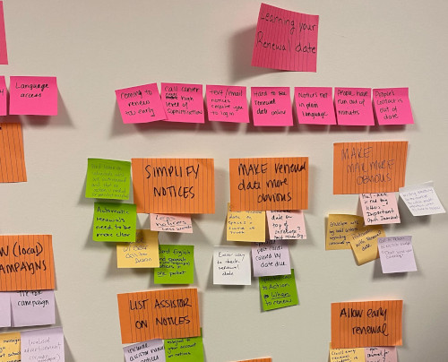

# Navigator Workshop

  

**When**: Usually on the Monday of the on-site, but can be any day early in the week of the on-site.

**Who**: The civic technology team, at least one representative from the state staff, and members of the Navigator organizations.

The Navigator workshop is a key activity for bringing voices and solutions from the Navigator community to the state. While typically there have already been several Navigator meetings prior to the workshop, this convening allows for common themes to be identified and synthesized into potential solutions.

The workshop is primarily **solutions oriented**. There will always be more challenges that people want to discuss, but the end result of the workshop should be solutions that the state feels can be considered.

The state should be represented throughout the workshop, and should be an active participant.

## Run of Show

_See the facilitator guide ([docx](../../resources/navigator-workshop-facilitation-guide.docx), [pdf](../../resources/navigator-workshop-facilitation-guide.pdf)) for a detailed schedule!_

### Prior to the Workshop

Arrive at the meeting space and ensure there are enough chairs, drinks, etc. for everyone.

### Arrival and Introduction - 10 minutes

Have the team and the state introduce themselves and the work. Have everyone go around the room and briefly introduce themselves. Go over the agenda.

### Share Back: Work to Date - 15 minutes

Present the work that's been done prior to the workshop. This should include:
  - Any meetings and research that have occurred in the weeks prior
  - An overview of the renewal journey map and what we know about it
  - The challenges we're already aware of

### Discussion: Challenges - 10 minutes

Lead a brief discussion on any challenges that were not listed in the share back. Are there things people feel are glaringly missing? Where do those things fall in the journey map?

### Introduce Activity - 5 minutes

Separate participants into groups. Each group should have one facilitator from the civic technology team. Take each group to a separate part of the room, and setup a place where people can write down thoughts and notes on stickies.

### Brainstorming Activity - 20 minutes

Spend 10 minutes brainstorming in the small group on the following items:
  - What challenges do you see during the renewal process?
  - What success do you see during the renewal process?
  - What opportunities do you see during the renewal process?

Then spend 10 minutes discussing any common themes you're seeing in the notes people are writing. Keep the group focused on the Medicaid renewal process itself; people may stray into applications, or other benefit programs.

### Clustering - 20 minutes

Bring the full group back together and read out insights from each group.
  - What insights did your group come up with?
  - Are they similar to insights mentioned by another group?
  - What feels like the most important or relevant items?

### Break - 10 minutes

Everyone's been talking a lot. Let them mingle and talk!

In the meantime, pull aside the state staff and ask: which of these opportunities feel real from their perspective? There may be good ideas that are totally infeasible; make a list of feasible opportunities to take into the next stage.

### Dot Voting - 10 minutes

Give everyone a number of dot stickers. Allow them to vote on which opportunities feel most important. If possible, guide sentiment towards the opportunities identified by the state staff.

### Adding Depth - 15 minutes

Separate into breakout groups again, this time with the following goals:
  - Sketch out what these opportunities might look like implemented.
  - Sketches can be rough, but should be captured via notes or drawings.

### Share Out - 15 minutes

Gather the large group back together. Have each small group read out their ideas.

### Closing - 10 minutes

Thank the group for coming, and note the following items:
  - These ideas will be shared with the state staff.
  - There will be follow up from the team!

Allow the state staff to share their own message of closing.
