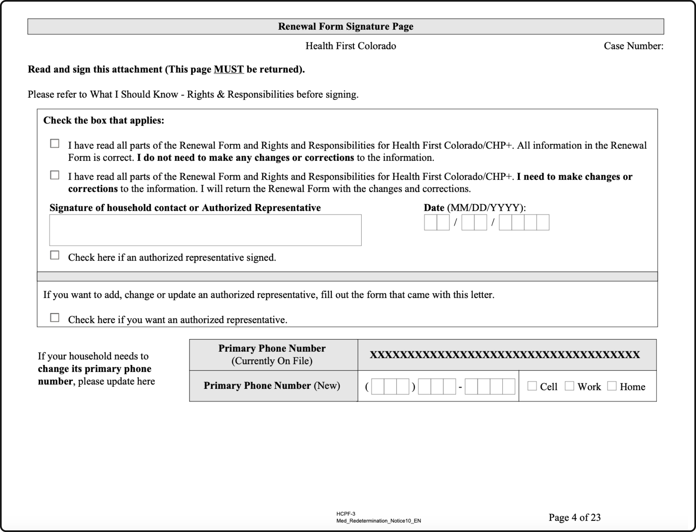
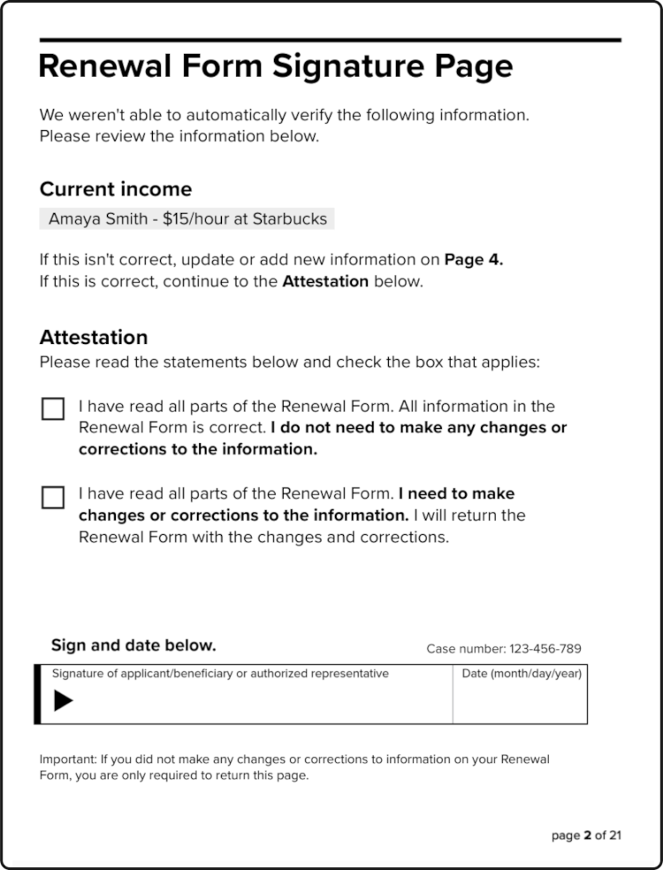

# Completing a renewal

Members who are not ex parte renewed for Medicaid must complete and turn in an annual renewal form. States are required to offer multiple modalities for completing and turning in the form, including a paper form mailed to the member’s house, an online renewal form, or an over-the-phone option. Regardless of the path, completing a renewal form can be burdensome and time-intensive for members. 

## Paper form
### Challenges
#### Not receiving the renewal packet
Some members never receive their renewal packet in the mail. Most often, this is a result of states not having an up-to-date address. Alternatively, some members do receive the packet in the mail, but perceive the envelope as spam or unimportant and throw it away without opening it. See [Outreach and messaging](../manual-renewals//outreach-and-messaging.md) for more on this topic.

#### Size of the renewal packet
The size of the renewal form is daunting, averaging 15-20 pages. After opening their renewal packet in the mail some decide not to complete it.

#### Lack of plain language
It’s challenging to understand what’s required across each section of the renewal form due to use of complex terms, lack of plain language, or unclear visual hierarchy.

#### Language access
Many have limited English proficiency and require translated materials to complete their renewal. However, not all languages are supported and members report variable quality across translated materials.

#### Income reporting
Understanding how to report current income and provide documents to prove it is one of the largest pain points across renewal forms, especially for non-W-2 earners. Words like “gross income” and the difference between “bi-weekly” and “semi-monthly” are unfamiliar to many. It’s intimidating to provide documents without assurance that the document will be accepted.

### Plays
#### Ask for data
Many states track data on renewal form *return rates.* This is the percentage of people who were sent a renewal form that successfully returned it. If this number is low, chances are that people are struggling to turn in the forms. For online forms, ask for drop off rates across the form, password reset attempts, identity verification success rates, and duplicate accounts created. For over-the-phone renewals, ask for average wait times, average call times, and issue resolution rates.

#### Talk to Navigators
Navigators provide 1:1 support to members of their community who need help completing their renewal form. They know *where* and *how often* people are getting stuck completing their renewal form, and the top questions people have about the form.

#### Usability test the form
Usability test the form with members of the public. Focus on people who face the greatest barriers to understanding the renewal form and completing it, including those who are new to the U.S., people with limited English proficiency, people with disabilities, and people with limited technology experience. 

#### Co-design improvements
Co-design improvements to the form with end-users, including members of the public, Navigators, and eligibility workers. Establish a Member Advisory Council to provide ongoing feedback on proposed changes to the form. Include members in the iterative design process; ask for feedback and ideas early and often.

#### Explore options to drastically reduce the burden of renewing
For example, including a cover page on the paper form which highlights specific questions on the form in need of attention or providing an options for renewers to return a single signature page if the information on their pre-filled form is still accurate. For renewing online, explore options to upload or renew online without requiring members to create an account or login (e.g. through providing other unique identifiers).

  

    
Example: <a href="https://hcpf.colorado.gov/sites/hcpf/files/Renewal%20Non-MAGI%20Packet%20in%20English.pdf">Colorado's Renewal Form Signature Page</a>

    
  
Full size image available <a href="../images/Colorado-Single-Page-Signature-Example-full-size.png">here</a>

    
  

  

    
Example: Cover Page Exploration

    

Full size image available <a href="../images/Single-Page-Attestation-Example-full-size.png">here</a>

  

## Online form
### Challenges
#### Multiple platforms
Some states advertise multiple online portals to renew online, creating confusion and frustration for some members. It’s unclear which is the “official” route to renew online or which is the easiest path for them.

#### Account access
Most states encourage members to renew online. However, members face challenges creating an account, logging in, and retrieving their password in order to renew. Many renewers don’t have access to a device to complete the online renewal, have no email account, and limited internet experience. 

#### Identity verification
Many eligible Medicaid members are unbanked or underbanked and, as such, are not represented in common identity verification databases. Furthermore, some states use Knowledge-Based Identity Verification which requires members to recall obscure facts that many do not remember. In many states, when a member’s identity cannot be verified, they are not able to renew online or view submitted documents.

#### Navigator permissions
Navigators play a crucial role in helping Medicaid members who cannot complete their renewal without assistance. However, across online portals, Navigators typically only have access to a limited view of client information. As a result, Navigators are required to call county or state-run Medicaid hotlines for basic information such as when a client is due for renewal or whether an eligibility worker has received the client’s documents. 

#### File size limits
Many online renewal document upload portals have small file size limits which require members, Navigators, and eligibility workers to manually reduce the size of images or PDF documents before uploading them. This is a time intensive, burdensome process for those with experience on how to do it and impossible for some to figure out.

### Plays
#### Ask for data
Ask for drop off rates across the form, password reset attempts, duplicate accounts, and identity verification success rates.

#### Usability test the online renewal experience
Directly observe users try to complete their renewal online, from creating an account and logging in through to submitting their form. Focus on people who face the greatest barriers to understanding the renewal form and completing it, including those who are new to the U.S., people with limited English proficiency, people with disabilities, and people with limited technology experience. Note the time it takes to complete each task, where people struggle or have questions, and whether or not each user was able to complete their online renewal successfully.

#### Co-design improvements
Co-design improvements to the form with end-users, including members of the public, Navigators, and eligibility workers. Establish a Member Advisory Council to provide ongoing feedback on proposed changes to the form. Include members in the iterative design process; ask for feedback and ideas early and often.

### Possible solutions
#### Clarify communications around where to renew online
Develop a clear path for online renewals by clarifying the quickest and easiest way to renew online among multiple existing platforms. Ensure communications are consistent across mediums (e.g. renewal packet, notices, official government websites, outreach campaigns).

#### Simplify the account creation process
Many members do not have an email address at the time of renewal, and Navigators report spending hours with members walking through the process and familiarizing members with email before creating their online renewal account account. Additionally, complex username and password requirements make it hard for members to successfully complete account creation. States should consider removing the requirement of an email address for members to complete their renewal online and review account creation policies to ensure ease of use for members.

#### Simplify account retrieval
Many members have duplicate accounts with their state, as it's often easier to create a new account than retrieve their old one. States should review the user experience of retrieving a lost username, password, or locked account to identify opportunities to simplify the process and increase success rates. Additionally, states should consider passwordless authentication options (e.g. through a Magic Link) which don't require users to remember a password to complete their renewal.

#### Explore login-less ways to renew online
Some states provide paths for members to upload documents without requiring them to create an account or log in, including proof of income or a completed renewal packet. Additionally, states could explore alternative paths and "guest login" options for members to complete their entire renewal online by providing personally identifiable information that links the member to their account (e.g. first and last name, DOB, SSN or ITIN, case number) as an alternative to login credentials.

#### Enable Navigator access
Navigators have the full trust of their clients, but often lack the permissions to view their client's renewal date, prepopulated renewal packet, case status, and confirm that documents have been successfully submitted. States should explore Navigator online access policies to ensure that they can sufficiently support their client's through the renewal process.

#### Expand file size limits
Members and Navigators are sometimes faced with the burden of having to resize files themselves or upload multiple different documents due to restrictive file size limits. States should expand file size limits to support the standard documents they accept (e.g. multi-page PDFs for the renewal packet) and high-resolution defaults across commonly used devices to share photos of documents (e.g. iPhone and Android smartphones).

## Phone-based renewals 
### Challenges
#### Long call center wait times
Call center wait times across the nation are high for help with Medicaid renewals. However, some counties reported experiencing more burden than others. Those living in a high-density urban areas are typically met with longer wait times than those living in rural areas.

#### Confusing IVR options
In some states, the option to renew over the phone is not an available option in the state’s interactive voice response (IVR) menu. In some states, language options that are available in the are not actually hooked up to a representative who speaks that language. 

#### Language access
Many states use Language Line for translations when bilingual agents are not available. However, this results in additional wait time for members with limited English profiency. Through the use of an interpreter as in Language Line, context is missed and key details get lost in translation.

### Plays
#### Listen in
Listen in while a member attempts to renew over the phone and document the experience. Note the time it takes to complete each task, where people struggle or have questions, and whether or not the member was able to complete their renewal successfully.

#### Ask for data
Ask for average wait times, average call times, containment rates, and issue resolution rates across the state. Compare state baseline data to data across regions (e.g. urban vs rural counties) and populations (e.g. English vs non-English speakers) to identify challenges across the phone-based renewal experience.

#### Review IVR menus
Review Interactive Voice Response (IVR) menus to ensure callers can easily and efficiently get routed to an agent who can help them complete their over the phone renewal.

#### Ensure language lines are usable for non-English speakers
In some states, language options that are available in the are not actually hooked up to a representative who speaks that language. 
