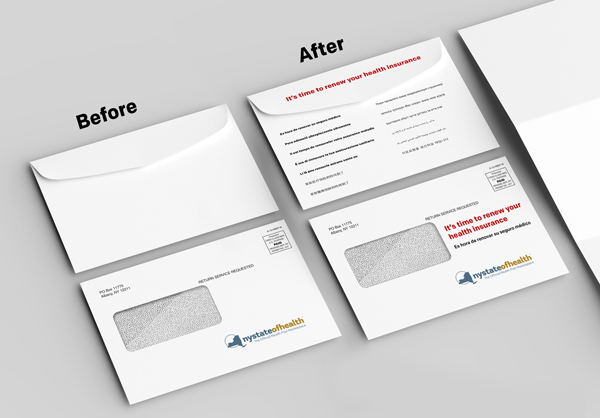
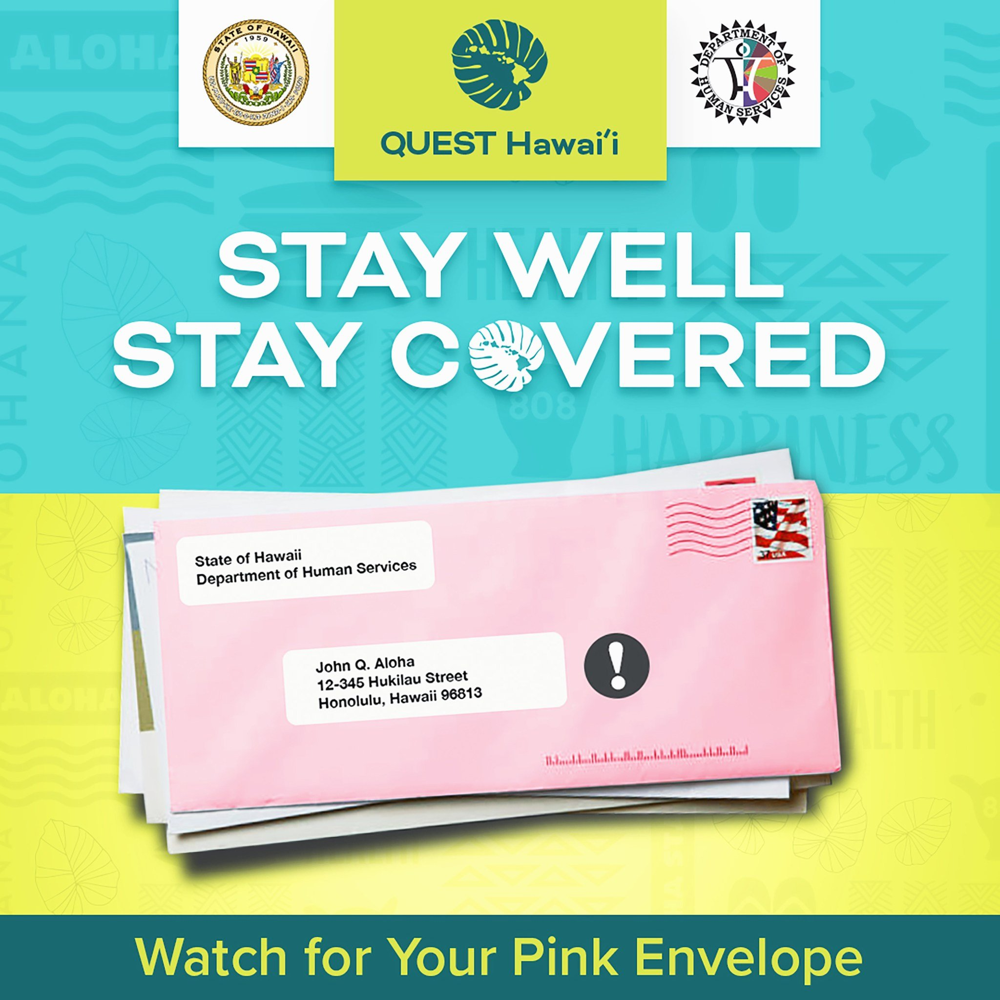

# Outreach and Messaging

Members of the public face many challenges in learning how and when to renew their Medicaid, from general awareness that renewals have resumed to accessing and understanding more targeted messaging about their own renewal date.
In many instances, the first time a member learns that they have missed their renewal date is when they try to use their coverage to fill a prescription or visit the doctor and get denied.

## General Awareness

### Challenges

States are struggling to get the word out to their members that renewals have resumed. Members have not needed to submit a renewal in 3 years, and many signed up during the PHE and have never needed to submit a renewal.
Some states have engaged in ad campaigns and have a coordinated comms strategy while other states lack the budget or resources to do so. 

#### Confusing messaging 

As states engage in various outreach methods, they often use terminology that is unfamiliar to their members. Phrases like “public health emergency” and “unwinding” do not have broad familiarity and can cause confusion and invoke feelings of panic. In an attempt to avoid these terms some states may have gone too far in the other direction, using language that is too generic and doesn’t make it clear why people should pay attention or take action. 

#### Getting the word to the right place

The Medicaid community is extremely diverse, which can make it challenging to reach all of them. States may or may not have the resources to place ads or the resources to put together a thoughtful comms strategy. It’s important to meet members where they are, meaning placing ads in multiple languages in key TV and radio markets as well as doctors offices, pharmacies, and on public transit.

#### SEO
While states are offering information about renewals on their websites, this information is not always easy to find. In some states, particularly those that are county-run, city, county, and state websites may compete with each other for search rankings. This makes it difficult for members to know where to go. Additionally, states are having to compete with scam websites that are placing ads in search results to trick members into providing their information or sell them a different insurance plan.

### Plays: 
* Review the state's comms strategy, if they have one
* Put yourself in the member's shoes and try common google search terms to see what comes up
* Work with navigator orgs to understand the messaging that resonates with their communities

## Targeted Messaging (Notices / Renewal Packets)

### Challenges: 

When it is time for an individual to complete their renewal, states often struggle to get that message to the member.

#### Out of date contact information

Official notices and reminders about renewal dates are not reaching participants who have moved, or changed their phone number or email address over the course of the pandemic. This is particularly challenging for recipients without permanent addresses or stable living conditions, and those who rely on pay-per-minute phones.

#### Phone & texting access

Even if a member has kept the same phone number, calls and text messages from the state may not get through if they have run out of minutes, if their plan doesn't allow texting, or if they live somewhere with poor reception.

#### Distinguishing official notices from spam

If the notice is successfully delivered to the participant, it may still be ignored. Mail, texts, and email from the state can often be hard to distinguish from spam. Often, letters are thrown away unopened and people may be hesitant to click links in texts or email. In some instances people may recognize the mail is from the state but still throw it away unopened. Some states have continued sending mail to participants throughout the PHE to keep them informed of their continuous coverage which has unintentionally conditioned people to think mail from the state is not important or actionable. In other instances, people may throw away mail unopened out of avoidance, because they have a fear of the government or because they find it overwhelming.

#### Plain language

Once people look at their notices, they may struggle to understand them. Notices often include confusing legalese that is not relevant or understandable to the average medicaid participant. These notices can do more harm than good, as confused recipients may not take the necessary action, or may take the wrong action based on them.

#### Language access

Many states support multiple languages, and translations of notices can also be a common issue. Notices may be translated word-by-word rather than interpreting the entire sentence to make the most sense in that language, leading to nonsensical instructions. In other cases, they may use antiquated or uncommon dialects, which do not reflect the language being commonly spoken. In these instances members may seek help from friends, family, or a navigator. However, if an English copy is not also provided then the original intent of the notice may be impossible to trace back.

#### Timing

The timing of notices can also be a challenge. Given inconsistencies in mail delivery timelines, multiple notices can sometimes arrive out of order, creating confusion. If states are sending texts/emails in addition to mail, the mail may arrive after the member has already taken action.

### Plays:
#### Use quantitative and qualitative research to understand if this is a challenge in the state you're working with and measure the baseline.
* Quantitative data: mail bounce/return rates, undeliverable rates for text messages, open rates for texts or emails
* Qualitative data: Navigators report that their clients are often throwing away their mail, and the first time people realize they have lost their coverage is when they try to use it (e.g. to fill a prescription) and get denied.

#### Design envelopes to make them stand out amongst other mail and make it clear that action is needed
Printing text on the outside of the envelope in key languages is a low-lift intervention that helps make it clear to members what the contents are and why it's important to open it. Using a unique color or design can also be effective when paired with strategic advertising so members recognize the envelope before it arrives.

  

    
Example: New York renewal notice envelope redesign

    
    
Full size image available <a href="../images/NY-Envelope-Mockup-beforeafter-fullsize.jpg">here</a>

  

  

    
Example: Hawaii's pink evelope campaign

    
    
Full size image available <a href="../images/hawaii_quest_pink_envelope-fullsize.jpeg">here</a>

  

  
#### Ad campaigns encouraging people to update their contact information. 
Ads should be placed in places where Medicaid participants are most likely to see them, such as TV, Radio, bus ads, doctor's offices, and pharmacies. Navigator's should be leveraged to spread the word in their communities.
#### Working with the National Change of Address (NCOA) database or MCOs to update recipient's addresses
#### Utilizing web-based messaging services like WhatsApp for outreach
Memers who run out of minutes may still connect to wifi, making web-based messaging a critical link to reach that population

